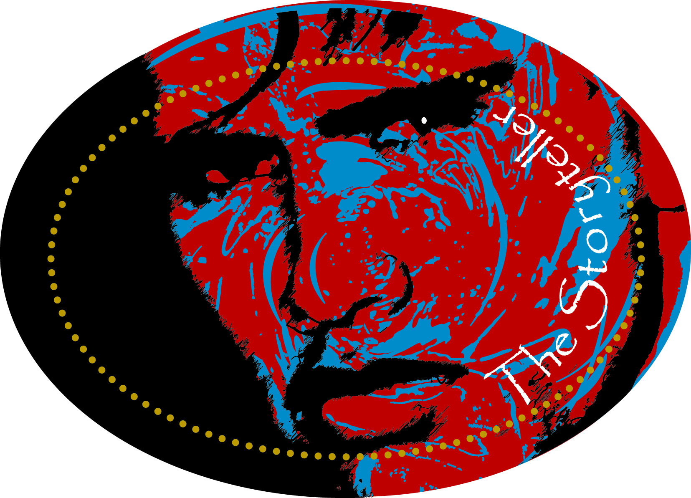

# StoryTeller

## 🛠️ Developer Setup Instructions

To set up the project locally, follow step-by-step guide: [Setup Guide.md](SETUP.md)

## 🤝 Contributing

To Contribute to the project read our [CONTRIBUTING.md](CONTRIBUTING.md) guide to get started with coding standards, branching, and pull requests.

## About the Project

**StoryTeller** is a digital game based on the original physical board game created by Glenn Shea, a respected Aboriginal elder from the Wathawurrung community.  
The physical game is designed as an educational experience to foster cultural understanding through storytelling and interactive gameplay.

Our university team is developing a new **online multiplayer version** of the game, using Unity, to expand its reach to primary and secondary school students across Australia and beyond.

You can try the current version of the board game online here:  
🔗 [Tabletopia - The Storyteller](https://tabletopia.com/games/cultural-workshop-ihp2ns/play-now)

## 🎯 Why We're Building This

- To help digitise and modernise a culturally significant game.
- To promote cultural learning in STEM education settings.
- To provide accessible storytelling experiences for students.
- To gain real-world experience in Unity development, game design, and team collaboration as part of our capstone project.

## Project Stakeholders

- **Product Owner**: Glenn Shea    
- **Supervisors**: Dr. Sophie McKenzie & Dr. Michael Hobbs (Deakin University)

> This project is part of a university capstone unit, developed by a student team in collaboration with Glenn Shea and Deakin University.

